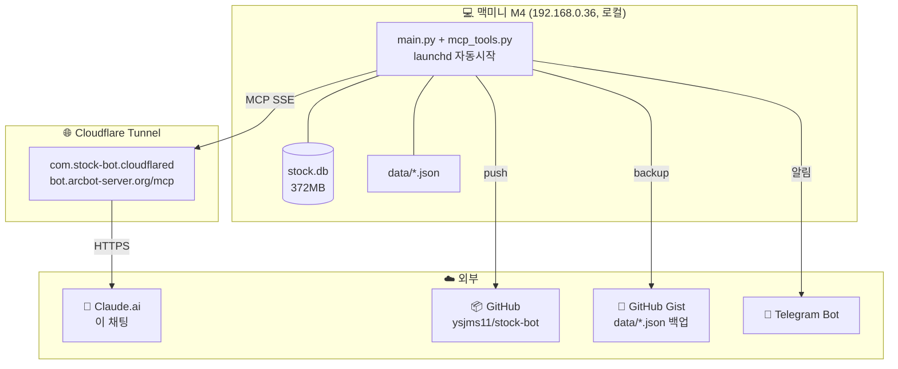
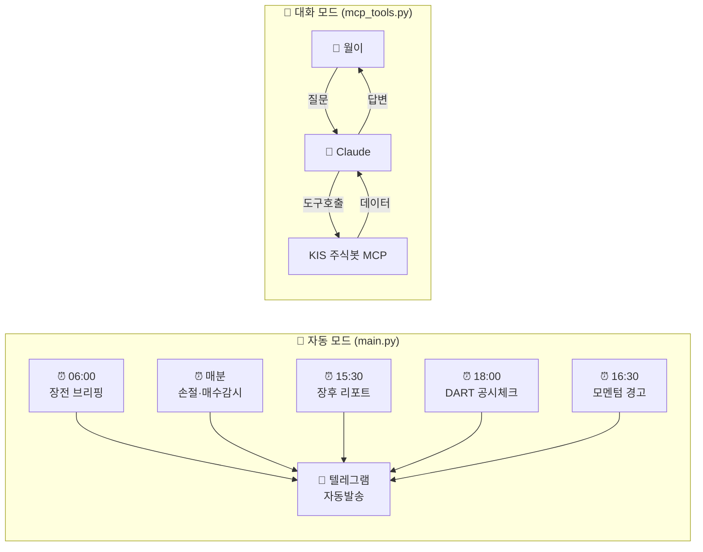

# 🏗️ 봇 아키텍처 한눈에 보기

> 월이가 봇 구조 헷갈릴 때 보는 문서. 2026-04-20 v1, 2026-05-04 v2 (인프라 섹션 + PENDING 추가).

## 핵심 한 줄 요약

> **`main.py`는 알람시계, `mcp_tools.py`는 비서.**
> 둘 다 같은 데이터(`stock.db` + `data/`)를 본다.

---

## 0️⃣ 인프라 (어디서 돌고 어떻게 연결되나)



**환경변수**: 맥미니 launchd plist 또는 `~/.zshenv` (Railway 잔재 사용 X)
- `KRX_UPLOAD_KEY=krx-upload-2026-secret-key-arct123`
- KIS API 토큰, Telegram Bot Token, Gist Token 등

**중요**: Oracle VM·Railway 사용 중단. 현재 100% 맥미니 로컬.

---

## 1️⃣ 전체 구조 (재료 → 요리 → 서빙)

```mermaid
flowchart TB
    subgraph EXT["🌐 외부 데이터 소스"]
        KIS[KIS API<br/>한투 실시간]
        KRX[KRX<br/>전종목]
        DART[DART<br/>공시]
        FnG[FnGuide<br/>컨센서스]
        YF[yfinance<br/>미국주식]
        PM[Polymarket<br/>매크로]
        FMP[FMP<br/>미국 애널]
    end

    subgraph COLLECT["📥 1단계: 수집"]
        K[kis_api.py]
        X[krx_crawler.py<br/>db_collector.py 호환 wrapper (SQLite 마이그레이션 완료)]
        C[db_collector.py<br/>⏰매일 자동수집]
        R[report_crawler.py<br/>⚠️ 와이즈리포트 차단]
    end

    subgraph STORE["💾 2단계: 저장"]
        DB[(stock.db<br/>372MB)]
        J[data/*.json<br/>포트·알림·상태]
        P[data/dart_reports/<br/>data/report_pdfs/<br/>data/thesis/]
    end

    subgraph BRAIN["🧠 3단계: 두뇌"]
        M[main.py 419KB<br/>알람시계 ⏰]
        MC[mcp_tools.py 258KB<br/>비서 💬]
    end

    subgraph OUT["📤 4단계: 출력"]
        T[📱 텔레그램]
        CL[💬 Claude 채팅]
    end

    EXT --> COLLECT
    COLLECT --> STORE
    STORE --> BRAIN
    M --> T
    MC --> CL
```

---

## 2️⃣ 두 가지 동작 모드



---

## 파일별 역할 정리

### 📥 수집 레이어
| 파일 | 역할 | 상태 |
|---|---|---|
| `kis_api.py` 364KB | 한국투자증권 API 래퍼 (시세, 수급, 주문) | ✅ |
| `krx_crawler.py` 60KB | db_collector.py 호환 wrapper (SQLite 마이그레이션 완료) | ✅ |
| `db_collector.py` 138KB | 위 두 개 돌려서 매일 DB에 쌓는 수집기 | ✅ |
| `report_crawler.py` 47KB | 증권사 리포트 PDF 다운로드 | ⚠️ 와이즈리포트 차단 (성공률 4.2%) |

### 💾 저장 레이어 (data/)
| 파일 | 역할 |
|---|---|
| `stock.db` (372MB) | SQLite. 일봉·수급·알파메트릭·DART공시 |
| `portfolio.json` | 보유 종목 + 현금 |
| `watchalert.json` | 손절가·매수감시 알림 (현 86건) |
| `watchlist_log.json` | 워치리스트 변동 이력 |
| `decision_log.json` | 투자판단 기록 |
| `trade_log.json` | 매매 기록 |
| `regime_state.json` | 시장 레짐 상태 (공격/중립/위기) |
| `consensus_cache.json` | 증권사 컨센서스 캐시 |
| `dart_seen.json` | DART 공시 중복방지 |
| `dart_reports/` | DART 사업보고서 txt 저장 (현 6건) |
| `report_pdfs/` | 증권사 리포트 PDF (현재 다수) |
| `thesis/[ticker]_[종목명].md` | 종목별 thesis 문서 (보유+감시) |
| `krx_db/` | KRX 일별 데이터 ⚠️ deprecated (stock.db로 통합, 5/4~) |
| `supply_history.json` | 보유+감시 종목 외인/기관 수급 일별 히스토리 (180일 보관, 백테스트용) |

### 🧠 두뇌 레이어
| 파일 | 역할 |
|---|---|
| `main.py` (419KB) | **텔레그램봇 + 스케줄러**. 정해진 시간에 알림 쏨 |
| `mcp_tools.py` (258KB) | **Claude 대화창구**. MCP 도구 정의 (get_*, set_*) |

### 📚 운영 문서 (data/)
| 파일 | 역할 |
|---|---|
| `INVESTMENT_RULES.md` | 전체 투자 규칙 (4규칙 체계, 매수/매도 트리거) |
| `KR_DEEPSEARCH.md` | 한국 종목 풀 딥서치 10단계 |
| `US_DEEPSEARCH.md` | 미국 종목 풀 딥서치 7단계 |
| `KR_EXIT.md` / `US_EXIT.md` | 매도 8단계 |
| `SAT_PORT_CHECK.md` | 토요일 포트 관리 루틴 |
| `SUN_DISCOVERY.md` | 일요일 신규 발굴 루틴 |
| `bot_guide.md` | MCP 도구 사용법 |
| `PROGRESS.md` | 봇 개발 진행 기록 |
| `PDF_INFRA_UPGRADE.md` | PDF 폴백 시스템 명세 (PENDING) |
| `TODO_invest.md` / `TODO_dev.md` | 투자/개발 TODO |
| `ARCHITECTURE.md` (이 파일) | 봇 구조 요약 |

### 📤 출력
- **텔레그램** ← `main.py`가 자동으로 (안 시켜도 알아서)
- **Claude 채팅** ← `mcp_tools.py`가 네 요청 받아서 (물어볼 때만)

---

## 3️⃣ 데이터 흐름 (구체적 사례)

### 사례 1: 손절가 알림
```
14:30 → main.py 스케줄러 깨어남
     → watchalert.json 읽음 (손절 종목 N개)
     → kis_api.py로 현재가 조회 (배치)
     → 손절가 도달 시 텔레그램 발송
     → stoploss_sent.json에 중복방지 기록
```

### 사례 2: Claude 한테 "058610 어때?" 질문
```
사용자 → Claude → MCP 도구 호출 분기:
  - get_stock_detail(ticker="058610") → KIS API 시세
  - get_supply(mode="history", ticker="058610", days=20) → DB 조회
  - get_consensus(ticker="058610") → consensus_cache.json
  - get_dart(mode="report", ticker="058610") → DART API + dart_reports/ 저장
  - manage_report(action="collect") → 와이즈리포트 (성공률 4.2%) ⚠️
  - read_report_pdf(ticker="058610") → report_pdfs/ PDF → 페이지 이미지화
  → Claude가 종합해서 답변
```

### 사례 3: 매매기록
```
set_alert(log_type="trade", side="buy", ticker="058610", qty=33, price=99000)
  → trade_log.json에 추가
  → portfolio.json 업데이트 (보유 + 현금 차감)
  → portfolio_history.json 일일 스냅샷
```

---

## 4️⃣ 자주 헷갈리는 것

**Q. 손절가 알림은 어디서 와?**
→ `main.py`의 스케줄러가 매분 `watchalert.json` 읽고 KIS API로 현재가 조회해서 텔레그램 발송

**Q. Claude한테 "삼전 어때?" 물으면 어떻게 답해?**
→ Claude가 `mcp_tools.py`의 `get_stock_detail("005930")` 호출 → KIS API 시세 + DB의 알파메트릭 + 컨센서스 캐시 종합해서 답

**Q. 매매기록은 어디 저장?**
→ `set_alert(log_type=trade)` → `trade_log.json` + `portfolio.json` 둘 다 업데이트

**Q. 서버는 어디서 돌아?**
→ Mac mini M4 (로컬, 192.168.0.36). 메인 Mac에서 SSH로 접속해서 Claude Code로 코드 수정.

**Q. Claude가 봇 도구 호출하는 경로는?**
→ Claude.ai → bot.arcbot-server.org/mcp (Cloudflare Tunnel) → 맥미니 mcp_tools.py SSE 서버

**Q. 데이터 백업은?**
→ GitHub Gist (data/*.json) ⚠️ PATCH 409 에러 PENDING. 매일 자동 백업 불안정.

**Q. KRX 데이터 왜 멈췄어?**
→ stock.db daily_snapshot으로 마이그레이션 완료 (2025-04-23 ~ 현재 266일 연속). data/krx_db/ JSON 백업은 deprecated.

---

## 5️⃣ 현재 PENDING (2026-05-04)

| # | 작업 | 우선순위 | 상태 |
|---|---|---|---|
| 1 | KRX 수급 수집 파이프라인 진단·복구 | ✅ 완료 | stock.db SQLite 마이그레이션 완료 (5/4~) |
| 2 | KRX OPEN API 전환 | 🟡 중간 | 4/4 신청, 승인 대기 |
| 3 | Gist 백업 PATCH 409 에러 | 🟡 중간 | 데이터 백업 불안정 |
| 4 | ~~bot_architecture.md 생성~~ | ✅ 완료 | 이 문서 (5/4 v2) |
| 5 | Railway 완전 삭제 | 🟢 낮음 | Procfile/runtime.txt/data_backup_before_railway/ |
| 6 | PDF 다운로드 인프라 폴백 시스템 | ✅ 완료 (폐기) | 5/27: pdf_collectors.py 구현 시도 후 폐기 (외부 broker 직접 URL 호환 한계). 대신 한경컨센서스 365일 확장 + naver 매핑 캐시(data/naver_pdf_cache.json, 30일 TTL)로 대체. data/PDF_INFRA_UPGRADE.md → INVALID 마킹됨. |
| 7 | git push 미완료 커밋 일괄 처리 | ✅ 완료 | 5/4 dcae76d까지 push 완료 |

---

## 6️⃣ n8n vs 이 봇

| 비교 | n8n 워크플로우 | 이 봇 |
|---|---|---|
| 트리거 | 사용자 메시지 (1회성) | 스케줄 + 사용자 (둘 다) |
| 로직 | 노드 시각 연결 | Python 코드 |
| 강점 | 시각화, 비개발자 수정 | 무거운 계산, MCP 직접연결 |
| 적합 | API 오케스트레이션 | 데이터 수집+계산+판단 |

---

## 변경 이력

- **2026-05-27 v4**: PENDING #6 정정 — pdf_collectors.py 폐기, 한경 365일 + naver 캐시로 대체
- **2026-05-26 v3**: KRX 데이터 상태 정정 (SQLite 마이그레이션 완료 반영), supply_history.json 역할 추가
- **2026-05-04 v2**: 인프라 섹션 (맥미니/Cloudflare Tunnel/MCP URL) 추가, 데이터 흐름 사례 3개 추가, PENDING 표 신설, 운영 문서 목록 추가
- 2026-04-20 v1: 최초 작성
