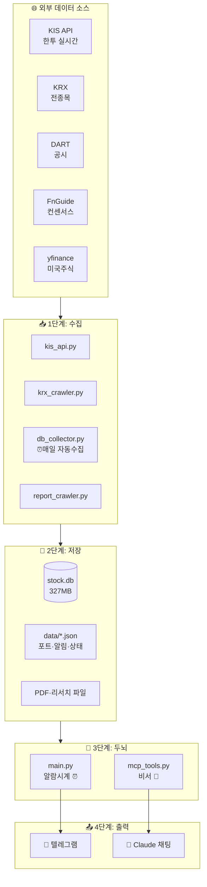
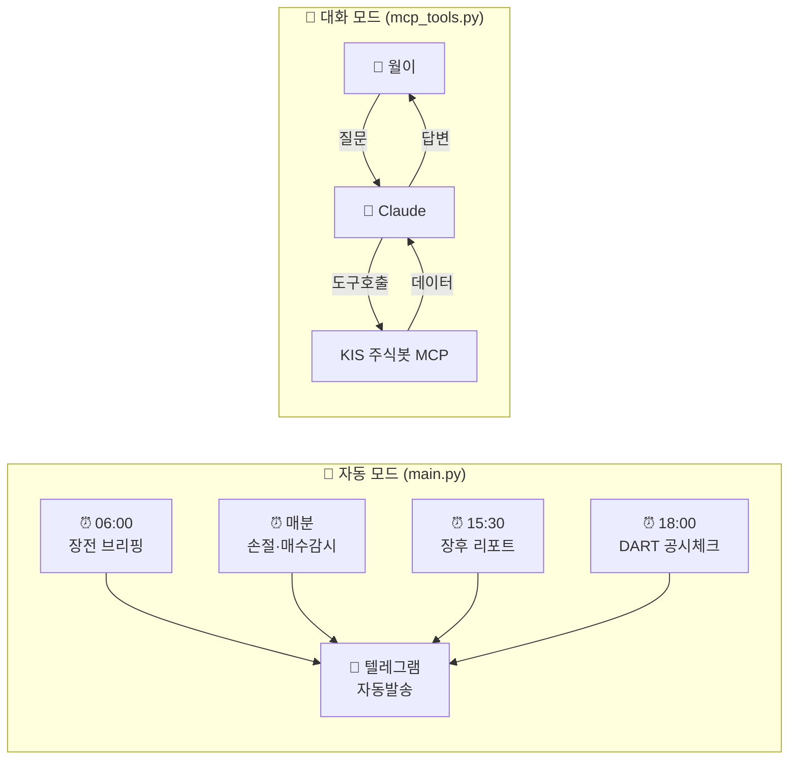

# 🏗️ 봇 아키텍처 한눈에 보기

> 월이가 봇 구조 헷갈릴 때 보는 문서. 2026-04-20 작성.

## 핵심 한 줄 요약

> **`main.py`는 알람시계, `mcp_tools.py`는 비서.**
> 둘 다 같은 데이터(`stock.db` + `data/`)를 본다.

---

## 1️⃣ 전체 구조 (재료 → 요리 → 서빙)

---

## 2️⃣ 두 가지 동작 모드

---

## 파일별 역할 정리

### 📥 수집 레이어
| 파일 | 역할 |
|---|---|
| `kis_api.py` | 한국투자증권 API 래퍼 (시세, 수급, 주문) |
| `krx_crawler.py` | KRX 전종목 데이터 크롤러 (시총, 외인비율 등) |
| `db_collector.py` | 위 두 개 돌려서 매일 DB에 쌓는 수집기 |
| `report_crawler.py` | 증권사 리포트 PDF 다운로드 |

### 💾 저장 레이어 (data/)
| 파일 | 역할 |
|---|---|
| `stock.db` (327MB) | SQLite. 일봉·수급·알파메트릭 |
| `portfolio.json` | 보유 종목 + 현금 |
| `watchalert.json` | 손절가·매수감시 알림 |
| `watchlist_log.json` | 워치리스트 변동 이력 |
| `decision_log.json` | 투자판단 기록 |
| `trade_log.json` | 매매 기록 |
| `regime_state.json` | 시장 레짐 상태 (공격/중립/위기) |
| `consensus_cache.json` | 증권사 컨센서스 캐시 |
| `dart_seen.json` | DART 공시 중복방지 |

### 🧠 두뇌 레이어
| 파일 | 역할 |
|---|---|
| `main.py` (257KB) | **텔레그램봇 + 스케줄러**. 정해진 시간에 알림 쏨 |
| `mcp_tools.py` (245KB) | **Claude 대화창구**. MCP 도구 정의 (get_*, set_*) |

### 📤 출력
- **텔레그램** ← `main.py`가 자동으로 (안 시켜도 알아서)
- **Claude 채팅** ← `mcp_tools.py`가 네 요청 받아서 (물어볼 때만)

---

## 자주 헷갈리는 것

**Q. 손절가 알림은 어디서 와?**
→ `main.py`의 스케줄러가 매분 `watchalert.json` 읽고 KIS API로 현재가 조회해서 텔레그램 발송

**Q. Claude한테 "삼전 어때?" 물으면 어떻게 답해?**
→ Claude가 `mcp_tools.py`의 `get_stock_detail("005930")` 호출 → KIS API 시세 + DB의 알파메트릭 + 컨센서스 캐시 종합해서 답

**Q. 매매기록은 어디 저장?**
→ `set_alert(log_type=trade)` → `trade_log.json` + `portfolio.json` 둘 다 업데이트

**Q. 서버는 어디서 돌아?**
→ Mac mini (로컬). 메인 Mac에서 SSH로 접속해서 Claude Code로 코드 수정.

---

## n8n vs 이 봇

| 비교 | n8n 워크플로우 | 이 봇 |
|---|---|---|
| 트리거 | 사용자 메시지 (1회성) | 스케줄 + 사용자 (둘 다) |
| 로직 | 노드 시각 연결 | Python 코드 |
| 강점 | 시각화, 비개발자 수정 | 무거운 계산, MCP 직접연결 |
| 적합 | API 오케스트레이션 | 데이터 수집+계산+판단 |
